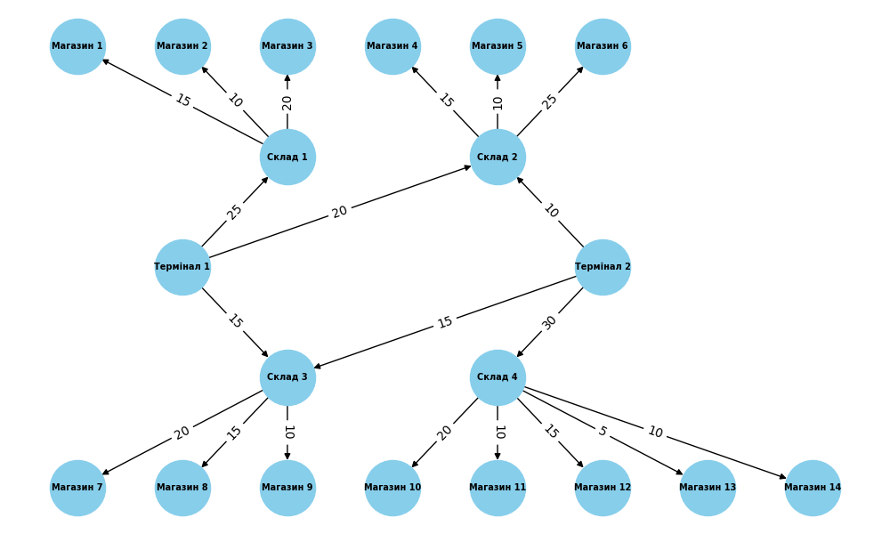

# Algorithms 2 Homework 3
## Task 1

Результат:

Термінал 1 ->  Магазин 1 - Максимальний потік: 15

Термінал 1 ->  Магазин 2 - Максимальний потік: 10

Термінал 1 ->  Магазин 3 - Максимальний потік: 20

Термінал 1 ->  Магазин 4 - Максимальний потік: 15

Термінал 1 ->  Магазин 5 - Максимальний потік: 10

Термінал 1 ->  Магазин 6 - Максимальний потік: 20

Термінал 1 ->  Магазин 7 - Максимальний потік: 15

Термінал 1 ->  Магазин 8 - Максимальний потік: 15

Термінал 1 ->  Магазин 9 - Максимальний потік: 10

Термінал 1 ->  Магазин 10 - Максимальний потік: 0

Термінал 1 ->  Магазин 11 - Максимальний потік: 0

Термінал 1 ->  Магазин 12 - Максимальний потік: 0

Термінал 1 ->  Магазин 13 - Максимальний потік: 0

Термінал 1 ->  Магазин 14 - Максимальний потік: 0

Термінал 2 ->  Магазин 1 - Максимальний потік: 0

Термінал 2 ->  Магазин 2 - Максимальний потік: 0

Термінал 2 ->  Магазин 3 - Максимальний потік: 0

Термінал 2 ->  Магазин 4 - Максимальний потік: 10

Термінал 2 ->  Магазин 5 - Максимальний потік: 10

Термінал 2 ->  Магазин 6 - Максимальний потік: 10

Термінал 2 ->  Магазин 7 - Максимальний потік: 15

Термінал 2 ->  Магазин 8 - Максимальний потік: 15

Термінал 2 ->  Магазин 9 - Максимальний потік: 10

Термінал 2 ->  Магазин 10 - Максимальний потік: 20

Термінал 2 ->  Магазин 11 - Максимальний потік: 10

Термінал 2 ->  Магазин 12 - Максимальний потік: 15

Термінал 2 ->  Магазин 13 - Максимальний потік: 5

Термінал 2 ->  Магазин 14 - Максимальний потік: 10

Сумарна пропускна здатність від Термінала 1 до будь-якого магазину
становить 130, так само як і від Термінала 2.

Термінал 2 має доступ до 11 з 14 магазинів, а Термінал 1 до 9, 
але маршрут до Магазину 13 має дуже низьку пропускну
здатність (5), через що, не дивлячись на доступ до більшої кількості
магазинів, Термінал 2 забезпечує такий самий потік, як і Термінал 1

Маршрути від Термінала 1 до Магазинів 7 і 6, а також від Термінала 2
до Магазинів 4, 6, 7 не отримують максимальну можливу кількість товарів
через низьку пропускну здатність маршрутів від Терміналів до Складів.

## Task 2

Результат:

Total range_query time for OOBTree: 5.714762720999715 seconds
Total range_query time for Dict: 2.2794990590009547 seconds

За умовою задачі потрібно використовувати items(min, max), який
повертає діапазон об'єктів за КЛЮЧЕМ, але який сенс його використовувати
у задачі на пошук об'єктів за ЦІНОЮ?